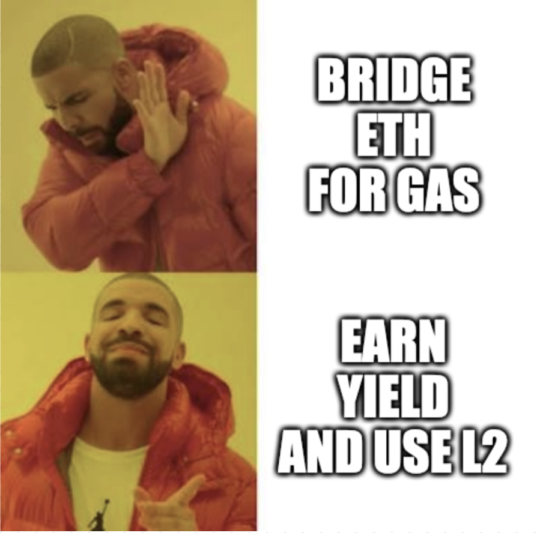
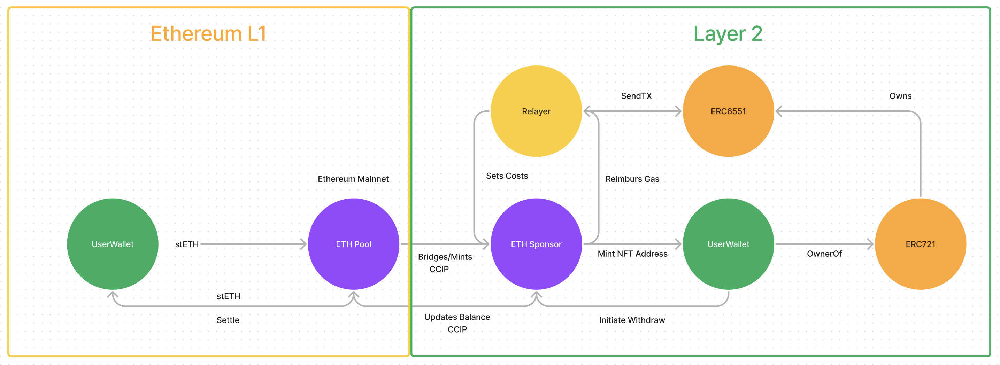

# GassGuzz

Hello I am Guzz, GassGuzz.

I am here to help users to stop bridging ETH to all the L2s, all the while making sure that they can still use their favorite DEXes and other DeFi protocols. AND, you can continue to earn a yield from staked ETH on Ethereum.

Maybe you even can earn enough to subsidize your gas costs on L2 forever?

## How it works

### Deposit

1. User deposits an LSD (staked ETH) to Depositor GassGuzz on Ethereum.
2. The Contract uses Chainlinks CCIP to send a message to the Sponsor Contract on L2.
3. The Sponsor Contract mints an NFT to the users address (ERC721), sets spend allowances and registers an Account with ERC6551.

### Transaction

1. User signs a message to execute a transaction on L2.
2. Sends it to an API endpoint, this is the Relayer.
3. The Relayer send the transaction on behalf of the user and gets reimbursed for the GAS.

### Withdraw

1. User initiates a withdrawal by burning the NFT.
2. The Sponsor Contract sends a message to the Depositor GassGuzz on Ethereum, containing the remaining gas allowance.
3. The Depositor GassGuzz sends the LSD to the user, minus the gas allowance.

## Better features that could be added

- Multiple L2s, so only one deposit on Ethereum is needed.
- Multiple LSDs, so users can choose their LSD of choice.
- A better way of using Account abstraction
- A more decentralized way of relaying transactions
